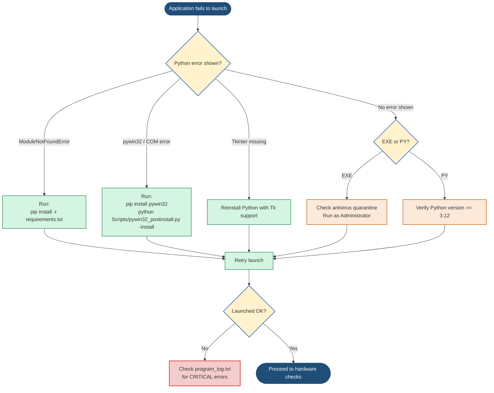
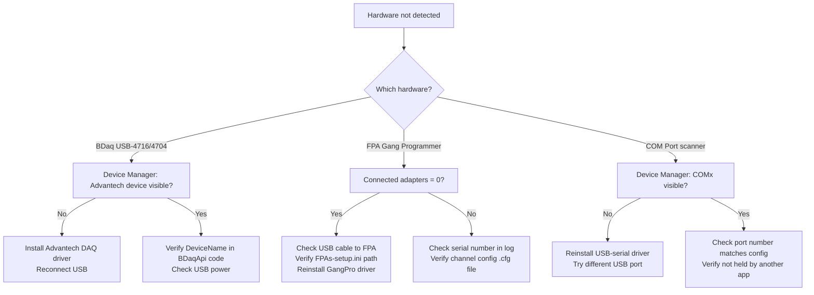
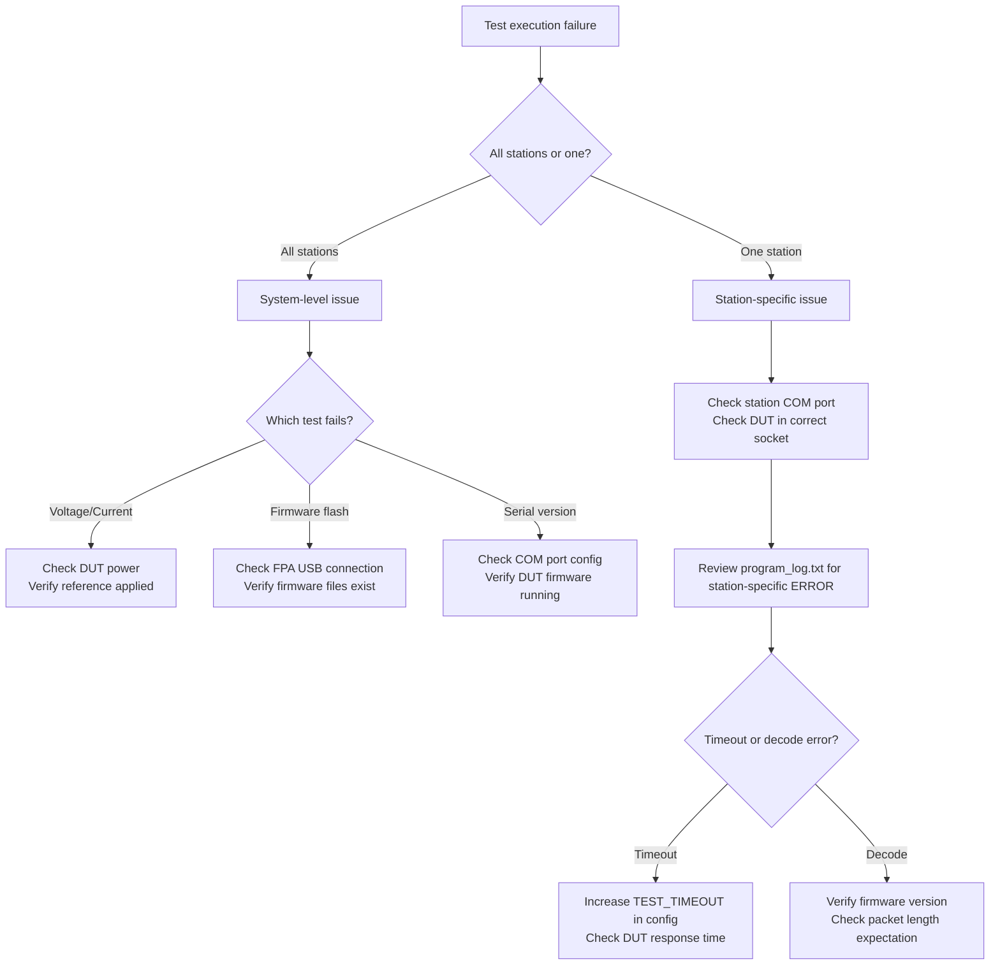
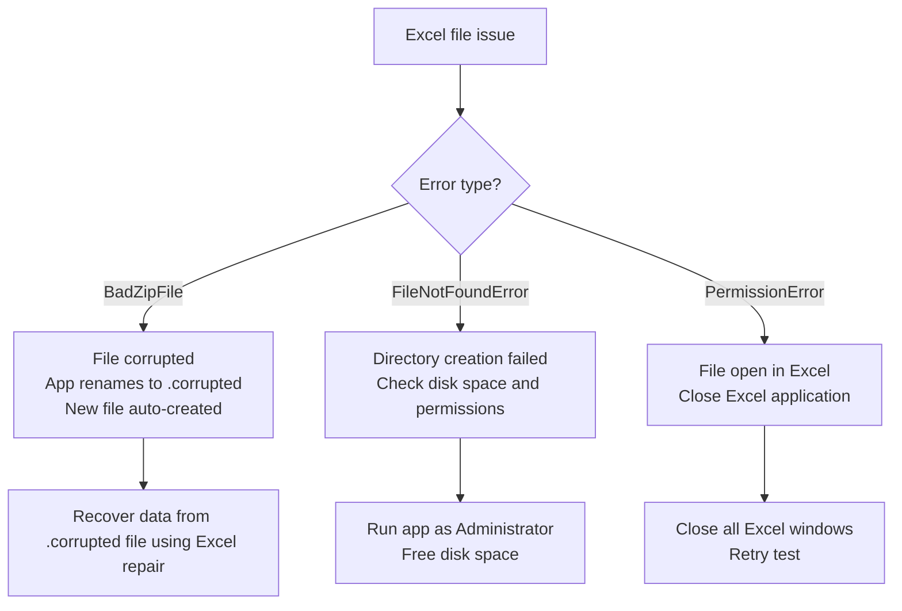
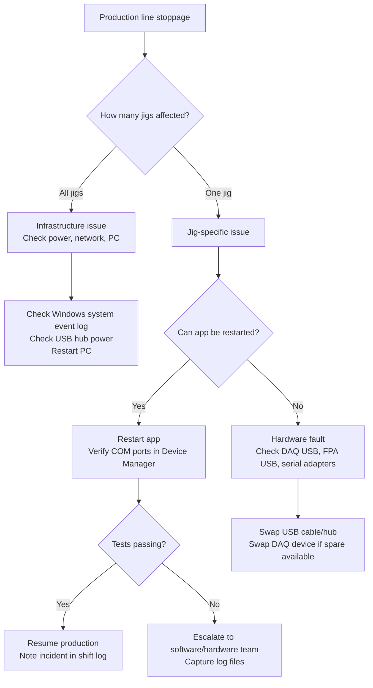
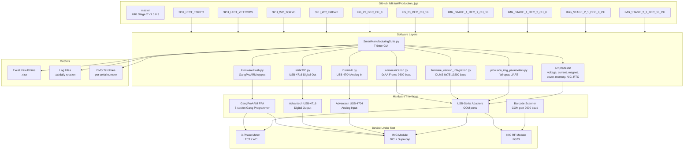

# Model-Wise Software Troubleshooting Guideline
## Production Jigs — SmartManufacturingSuite

---

**Document Version:** 2.0  
**Date:** 2026-06-15  
**Repository:** https://github.com/lalit-tak/Production_jigs  
**Author:** Polaris Grids Engineering  
**Classification:** Internal — Production Use Only  

---

## Table of Contents

1. [Document Overview](#1-document-overview)
2. [Repository Analysis](#2-repository-analysis)
3. [Model Identification Matrix](#3-model-identification-matrix)
4. [Model-Wise Troubleshooting Guide](#4-model-wise-troubleshooting-guide)
   - 4.1 [FG23 — NIC RF Test Jig](#41-fg23--nic-rf-test-jig)
   - 4.2 [3PH LTCT — 3-Phase LTCT Test Jig](#42-3ph-ltct--3-phase-ltct-test-jig)
   - 4.3 [3PH WC — 3-Phase Whole-Current Test Jig](#43-3ph-wc--3-phase-whole-current-test-jig)
   - 4.4 [IMG Stage 1 — Firmware Flash & Provisioning Jig](#44-img-stage-1--firmware-flash--provisioning-jig)
   - 4.5 [IMG Stage 2 — RF & Power Test Jig (8CH / 16CH)](#45-img-stage-2--rf--power-test-jig-8ch--16ch)
5. [Software Logs Analysis Guide](#5-software-logs-analysis-guide)
6. [Diagnostic Flowcharts](#6-diagnostic-flowcharts)
7. [Root Cause Analysis (RCA) Matrix](#7-root-cause-analysis-rca-matrix)
8. [Recovery Procedures](#8-recovery-procedures)
9. [Preventive Maintenance Checklist](#9-preventive-maintenance-checklist)
10. [Version Compatibility Matrix](#10-version-compatibility-matrix)
11. [Deployment & Upgrade Troubleshooting](#11-deployment--upgrade-troubleshooting)
12. [Emergency Troubleshooting Quick Reference](#12-emergency-troubleshooting-quick-reference)
13. [Recommendations](#13-recommendations)

---

## 1. Document Overview

### 1.1 Purpose

This document provides a comprehensive, model-specific software troubleshooting reference for production engineers, NPI engineers, software developers, test engineers, maintenance teams, and shop-floor operators working with the Production Jigs platform (`SmartManufacturingSuite`). All information is derived directly from the repository source code, branch configurations, and actual test scripts.

### 1.2 Scope

This guide covers all jig models currently present in the `Production_jigs` repository:

- FG23 NIC RF Test Jig (Branches: `FG_23_DEC_CH_8`, `FG_23_DEC_CH_16`)
- 3PH LTCT Test Jig (Branches: `3PH_LTCT_TOKYO`, `3PH_LTCT_ZETTOWN`)
- 3PH WC Test Jig (Branches: `3PH_WC_TOKYO`, `3PH_WC_zettown`)
- IMG Stage 1 Jig (Branches: `IMG_STAGE_1_DEC_1_CH_16`, `IMG_STAGE_1_DEC_2_CH_8`)
- IMG Stage 2 Jig (Branches: `IMG_STAGE_2_1_DEC_8_CH`, `IMG_STAGE_2_1_DEC_16_CH`)

### 1.3 Supported Models

| Model Code | Full Name | Jig Purpose |
|------------|-----------|-------------|
| FG23 | Smart Meter NIC RF Test | RF radio link test for NIC modules |
| 3PH-LTCT | 3-Phase LTCT Meter Test | Live test of 3-phase voltage, current, metering |
| 3PH-WC | 3-Phase Whole-Current Meter Test | Whole-current meter functional test |
| IMG-STG1 | IMG Module Stage 1 | Firmware flash + optical + provisioning |
| IMG-STG2 | IMG Module Stage 2 | RF RSSI, supercapacitor, power & EMS test |

### 1.5 Software Architecture Overview

```
SmartManufacturingSuite.py (Main GUI — Tkinter)
│
├── FirmwareFlash.py                  ← Gang firmware programmer (IMG Stage 1, LTCT, WC)
│   └── GangProARM-FPAsel.dll         ← ctypes binding for Segger/gang programmer hardware
│
├── scripts/utils/communication.py    ← Serial packet protocol (0xAA frame, 9600 baud)
│
├── scripts/tests/                    ← Per-test Python modules (subprocess-launched)
│   ├── live_version_test.py          ← Firmware version verification (LTCT, WC)
│   ├── rtc_calibration_test.py       ← RTC drift calibration (LTCT, WC)
│   ├── digital_input/
│   │   ├── voltage_test.py           ← 3-phase R/Y/B voltage decode
│   │   ├── current_test.py           ← 3-phase R/Y/B/N current decode
│   │   ├── magnet_status_test.py     ← Magnetic tamper sensor
│   │   ├── cover_open_test.py        ← Cover tamper switch
│   │   ├── push_button1/2_test.py    ← Push button debounce
│   │   ├── memory_test.py            ← EEPROM/flash memory test
│   │   ├── nic_status_test.py        ← NIC module presence
│   │   ├── rx_tx_status_test.py      ← UART loopback
│   │   ├── md_reset_button_test.py   ← Manual demand reset
│   │   ├── get_efuse_mode.py         ← eFuse security read
│   │   └── set_efuse_mode.py         ← eFuse security write
│   │
│   ├── IMG_Provisioning_Testing_Scripts/
│   │   ├── provision_img_parameters.py   ← Write manufacturing params (Wirepas mesh)
│   │   ├── read_img_parameters.py        ← Verify provisioned params
│   │   ├── wirepas_provisioning.py       ← Wirepas network provisioning
│   │   ├── testing.py                    ← RF RSSI test orchestrator
│   │   └── factory_mode.py               ← Factory mode activation
│   │
│   ├── staticDO.py                   ← Advantech BDaq Digital Output (IMG Stage 1/2)
│   └── InstantAI.py                  ← Advantech BDaq Analog Input (IMG Stage 1/2)
│
├── scripts/Automation/BDaq/          ← Full Advantech BDaq Python SDK (DO/DI/AI/AO)
│
├── firmware_version_integration.py   ← DLMS/COSEM serial firmware version check (FG23)
├── errors_dll.py                     ← GangProARM DLL error code lookup table
├── serial_config.enc                 ← Encrypted COM port configuration (Fernet/PBKDF2)
├── config.txt                        ← Plain-text COM port config (LTCT/WC jigs)
└── firmwareflash_config.json         ← Firmware filenames config (WC branch)
```

### 1.6 System Dependencies

| Dependency | Version/Notes | Used By |
|------------|---------------|---------|
| Python | 3.12 / 3.13 | All branches |
| pyserial | Latest | All serial communication |
| openpyxl | Latest | Test result Excel files |
| Pillow (PIL) | Latest | GUI logo/branding rendering |
| tkinter | stdlib | GUI framework |
| cryptography (Fernet) | Latest | serial_config.enc decryption |
| psutil | Latest | Process kill / timeout management |
| crcmod | Latest | Packet CRC validation |
| pythoncom / win32gui / win32con / win32com | pywin32 | IMG Stage 2 (Windows COM) |
| Advantech BDaq | USB-4704 / USB-4716 | IMG Stage 1/2 DAQ hardware |
| GangProARM-FPAsel.dll | Segger OEM | Firmware flash (LTCT, WC, IMG Stage 1) |

---

## 2. Repository Analysis

### 2.1 Branch-to-Model Mapping

```
Production_jigs (GitHub)
├── master              ← IMG Stage 2 (V1.0.0.3 binary + serial_config.enc only)
├── 3PH_LTCT_TOKYO      ← 3PH LTCT — Tokyo factory, full suite
├── 3PH_LTCT_ZETTOWN    ← 3PH LTCT — Zettown factory variant
├── 3PH_WC_TOKYO        ← 3PH WC — Tokyo factory, firmwareflash_config.json
├── 3PH_WC_zettown      ← 3PH WC — Zettown factory variant
├── FG_23_DEC_CH_8      ← FG23 NIC RF — 8-channel jig
├── FG_23_DEC_CH_16     ← FG23 NIC RF — 16-channel jig
├── IMG_STAGE_1_DEC_1_CH_16 ← IMG Stage 1 — 16CH DAQ layout
├── IMG_STAGE_1_DEC_2_CH_8  ← IMG Stage 1 — 8CH DAQ layout (alt)
├── IMG_STAGE_2_1_DEC_8_CH  ← IMG Stage 2 — 8CH DAQ layout
└── IMG_STAGE_2_1_DEC_16_CH ← IMG Stage 2 — 16CH DAQ layout
```

### 2.2 Key Software Modules

| Module | File | Branch(es) | Purpose |
|--------|------|------------|---------|
| Main GUI | `SmartManufacturingSuite.py` | All | Tkinter UI, orchestration, station management |
| Legacy Main | `SMS.py` | FG23, IMG-STG2 | Earlier GUI variant |
| Firmware Flash | `FirmwareFlash.py` | LTCT, WC, IMG-STG1 | GangProARM DLL wrapper |
| Main Firmware Flash | `MainFirmwareFlash.py` | FG23, IMG-STG2 | Alternate flash controller |
| Communication | `scripts/utils/communication.py` | LTCT, WC | 0xAA-framed serial protocol |
| Firmware Version | `firmware_version_integration.py` | FG23, IMG-STG2 | DLMS/COSEM 0x7E-framed check |
| Error Codes | `errors_dll.py` | FG23, IMG-STG2 | GangProARM status code map |
| IMG Provision | `provision_img_parameters.py` | IMG-STG2 | Wirepas parameter write |
| BDaq SDK | `scripts/Automation/BDaq/` | IMG-STG1/2 | Advantech DAQ Python API |
| DI/DO Tests | `scripts/tests/staticDO.py` | IMG-STG1/2 | USB-4716 digital output |
| AI Read | `scripts/tests/InstantAI.py` | IMG-STG1/2 | USB-4704 analog input |

### 2.3 Configuration Files

| File | Location | Format | Description |
|------|----------|--------|-------------|
| `serial_config.enc` | Root | Fernet-encrypted | COM port assignments (password: `Polaris@1234`) |
| `config.txt` | Root | KEY=VALUE | COM port config (LTCT/WC plain-text) |
| `firmwareflash_config.json` | Root | JSON | Firmware filenames for flash |
| `FPAs-setup.ini` | `firmware_flash_files/` | INI | GangPro adapter initialization |
| `*GangConfig.cfg` | `ConfigFiles/` | Binary/text | Gang programmer channel config |
| `RF_criteria.json` | Root (FG23/IMG-STG2) | JSON | RSSI pass/fail thresholds |
| `Load_channel_data.json` | Root (FG23) | JSON | Channel data mapping |
| `requirements.txt` | Root | pip format | Python dependencies |

### 2.4 Hardware Interfaces

| Interface | Hardware | Protocol | Branches |
|-----------|----------|----------|---------|
| Serial COM | Meter DUT | Custom 0xAA frame, 9600 baud | LTCT, WC |
| Serial COM | NIC scanner / barcode | Serial trigger `*T`, 9600 baud | FG23, IMG |
| Serial COM | Meter firmware | DLMS/COSEM 0x7E frame, 19200 baud | FG23 |
| USB-CDC | FPA Adapter | GangProARM DLL (ctypes) | LTCT, WC, IMG-STG1 |
| USB-DAQ DO | Advantech USB-4716 | BDaq SDK | IMG-STG1/2 |
| USB-DAQ AI | Advantech USB-4704 | BDaq SDK | IMG-STG1/2 |
| Wirepas RF | NIC Module | UART provisioning | IMG-STG2 |
| Optical | Meter optical port | Serial, 9600 baud | IMG-STG1 |

### 2.5 Log & Output Files

| Output Type | Location | Format | Notes |
|-------------|----------|--------|-------|
| Program log | `Log files/Log_file_YYYY-MM-DD/YYYY-MM-DD_program_log.txt` | Text | DEBUG level; daily rotation |
| Action log | `Log files/Log_file_YYYY-MM-DD/action_log.txt` | Text | Operator actions with serial number |
| Test result | `Test Result Excel File/Test_Result_YYYY-MM-DD/YYYY-MM-DD_*.xlsx` | Excel | Per-station result rows |
| EMS result | `EMS Test Result/YYYY-MM-DD/<SERIAL>_PASS.txt` | Text | EMS-format per-device result |
| Detailed log | `scripts/tests/IMG_Provisioning_Testing_Scripts/Detailed Test Result/` | Text | IMG provisioning detail |

---

## 3. Model Identification Matrix

| Model Name | Software Module | Jig Type | Production Stage | Key Dependencies | Branch |
|------------|----------------|----------|-----------------|-----------------|--------|
| FG23 (8CH) | `SmartManufacturingSuite.py` + `SMS.py` | NIC RF Test | Module sub-assembly | pyserial, openpyxl, GangProARM DLL, firmware_version_integration | `FG_23_DEC_CH_8` |
| FG23 (16CH) | `SmartManufacturingSuite.py` + `SMS.py` | NIC RF Test | Module sub-assembly | pyserial, openpyxl, GangProARM DLL, firmware_version_integration | `FG_23_DEC_CH_16` |
| 3PH LTCT Tokyo | `SmartManufacturingSuite.py` | 3-Phase Meter Test | Final test | pyserial, openpyxl, GangProARM DLL, communication.py, digital_input tests | `3PH_LTCT_TOKYO` |
| 3PH LTCT Zettown | `SmartManufacturingSuite.py` | 3-Phase Meter Test | Final test | pyserial, openpyxl, config.txt | `3PH_LTCT_ZETTOWN` |
| 3PH WC Tokyo | `SmartManufacturingSuite.py` | Whole-Current Meter Test | Final test | pyserial, openpyxl, GangProARM DLL, firmwareflash_config.json | `3PH_WC_TOKYO` |
| 3PH WC Zettown | `SmartManufacturingSuite.py` | Whole-Current Meter Test | Final test | pyserial, openpyxl | `3PH_WC_zettown` |
| IMG Stage 1 (16CH) | `SmartManufacturingSuite.py` | Firmware Flash + Provision | Module assembly | BDaq, GangProARM DLL, staticDO, InstantAI, serial_config.enc | `IMG_STAGE_1_DEC_1_CH_16` |
| IMG Stage 1 (8CH) | `SmartManufacturingSuite.py` | Firmware Flash + Provision | Module assembly | BDaq, GangProARM DLL, staticDO, InstantAI, serial_config.enc | `IMG_STAGE_1_DEC_2_CH_8` |
| IMG Stage 2 (8CH) | `SmartManufacturingSuite.py` | RF + Power Test | Module final test | BDaq, pywin32, staticDO, InstantAI, provision scripts, serial_config.enc | `IMG_STAGE_2_1_DEC_8_CH` |
| IMG Stage 2 (16CH) | `SmartManufacturingSuite.py` | RF + Power Test | Module final test | BDaq, pywin32, staticDO, InstantAI, provision scripts, serial_config.enc | `IMG_STAGE_2_1_DEC_16_CH` |

---

## 4. Model-Wise Troubleshooting Guide

---

### 4.1 FG23 — NIC RF Test Jig

#### Purpose

The FG23 jig validates NIC (Network Interface Card) radio module sub-assemblies. It performs firmware flashing (test + main firmware), RF link quality testing (RX/TX RSSI), external flash test, firmware version verification via DLMS/COSEM protocol (0x7E frames at 19200 baud), and supercap voltage measurement. Supports **6 stations** simultaneously. Two variants: 8-channel DAQ (`FG_23_DEC_CH_8`) and 16-channel DAQ (`FG_23_DEC_CH_16`).

#### Test Sequence (All FG23 Variants — 11 Steps)

| Step | Test Name | Action |
|------|-----------|--------|
| 1 | Mapped with COM Port | COM port assigned to station |
| 2 | Module Supply On | DO write — powers module |
| 3 | LDO Voltage | AI read — LDO rail measurement |
| 4 | Super Cap Charge Voltage | AI read — supercap charge measurement |
| 5 | Test Firmware Download | Firmware flash via GangProARM |
| 6 | External Flash Test | Verify external SPI flash |
| 7 | RSSI Test | RF RX/TX RSSI measurement (0x7E, 19200 baud) |
| 8 | Main Firmware Download | Main firmware flash via GangProARM |
| 9 | Main Firmware Verification | DLMS version check — `packet[4] == 0x15` |
| 10 | Module Supply Off | DO write — powers down module |
| 11 | Super Cap Discharge Voltage | AI read — supercap discharge measurement |

#### DAQ Digital Output Map — FG23 8CH (`FG_23_DEC_CH_8`)

> `staticDO.py` invoked with only `--inputVal`; device description hardcoded inside `staticDO.py`.

| DO Hex Value | Test Step | Meaning |
|-------------|-----------|---------|
| `0x01` | Module Supply On | Turn module supply ON |
| `0x02` | Module Reset (between firmware flashes) | Temporary reset / supply off |
| `0x05` | Module Supply Off | Turn module supply OFF |

#### DAQ Digital Output Map — FG23 16CH (`FG_23_DEC_CH_16`)

> Device: `USB-4716,BID#0` (from `serial_config.enc` key `DAC_COM`). DO values are decimal strings (`'06'`, `'05'`).

| DO Hex Value | Test Step | Meaning |
|-------------|-----------|---------|
| `0x06` | Module Supply On | Turn ON module supply |
| `0x05` | Module Supply Off / Firmware reset cycles | Turn OFF module supply (also used between firmware flash steps) |

> **Critical:** FG23 8CH and 16CH use **different DO values** for supply on (`0x01` vs `0x06`). Deploying the wrong branch on the wrong card will apply incorrect power states.

#### DAQ AI Channel Map — FG23 8CH (`FG_23_DEC_CH_8`)

> Card: `USB-4716,BID#` — channel formulas: LDO = `station_num + 4`; SuperCap = `station_num - 1`

| Station | LDO Voltage | SuperCap Charge | SuperCap Discharge |
|---------|------------|----------------|-------------------|
| 1 | CH5 | CH0 | CH0 |
| 2 | CH6 | CH1 | CH1 |
| 3 | CH7 | CH2 | CH2 |
| 4 | CH8 | CH3 | CH3 |
| 5 | CH9 | CH4 | CH4 |
| 6 | CH10 | CH5 | CH5 |

#### DAQ AI Channel Map — FG23 16CH (`FG_23_DEC_CH_16`)

> Card: `USB-4716,BID#0` — channel formulas: LDO = `station_num + 6`; SuperCap = `station_num - 1`. Requires 16-channel AI card (LDO channels reach CH12).

| Station | LDO Voltage | SuperCap Charge | SuperCap Discharge |
|---------|------------|----------------|-------------------|
| 1 | CH7 | CH0 | CH0 |
| 2 | CH8 | CH1 | CH1 |
| 3 | CH9 | CH2 | CH2 |
| 4 | CH10 | CH3 | CH3 |
| 5 | CH11 | CH4 | CH4 |
| 6 | CH12 | CH5 | CH5 |

#### Excel Column Schema (`YYYY-MM-DD_NIC_RF_TEST_RESULT.xlsx`) — 23 Columns

| # | Column Header | # | Column Header |
|---|--------------|---|--------------|
| 1 | Station Number | 13 | RF Status |
| 2 | NIC serial number | 14 | External Flash |
| 3 | Start Time | 15 | Main Firmware Test |
| 4 | End Time | 16 | Firmware Version |
| 5 | Module Supply On | 17 | Expected Firmware Version |
| 6 | LDO Voltage | 18 | Firmware Version Test Status |
| 7 | LDO Voltage Status | 19 | Module Supply Off |
| 8 | Supercap Charging Voltage | 20 | Supercap Discharging Voltage |
| 9 | Supercap Charging Voltage Status | 21 | Supercap Discharging Voltage Status |
| 10 | Test Firmware Test | 22 | Overall Result |
| 11 | RX RSSI | 23 | Total Time |
| 12 | TX RSSI | | |

> Result files: `Test Result Excel File/Test_Result_YYYY-MM-DD/YYYY-MM-DD_NIC_RF_TEST_RESULT.xlsx`  
> EMS files: `EMS Test Result/YYYY-MM-DD/{serial_number}_{PASS|FAIL}.txt`

#### Firmware Configuration

| Branch | Config Source | Test Firmware Key | Main Firmware Key | Gang Config |
|--------|--------------|------------------|-------------------|------------|
| 8CH | `config.txt` (1=COM3, 2=COM4, …) | Loaded per `config.txt` station map | Loaded per `config.txt` | `ConfigFiles/GangConfig.cfg` |
| 16CH | `serial_config.enc` | `Test_Firmware` | `Main_Firmware` | `Gang_Programming_Code_File` |

> Default expected firmware version: `6.0.0.0` (from `ConfigFiles/firmware_config.txt`). All stations will fail Main Firmware Verification if the actual flashed version differs.

#### Known Bugs (FG23)

| # | Branch | Severity | Bug |
|---|--------|----------|-----|
| 1 | 8CH | MEDIUM | `staticDO.py` invoked without `--deviceDescription` argument — device description must be hardcoded inside `staticDO.py` and cannot be configured externally |
| 2 | 8CH | MEDIUM | `firmware_config.txt` defaults to `'6.0.0.0'` — all stations fail FW verification until this file is updated |
| 3 | 8CH | MEDIUM | Result dict key `'Module_Supply_On'` (underscore) does not match task indicator key `'Module Supply On'` (space) — potential `KeyError` at runtime |
| 4 | 16CH | LOW | `load_expected_firmware_version()` defined in `firmware_version_integration.py` but never called — version comparison uses `serial_config.enc` directly |

#### Startup Flow

1. Python runtime launches `SmartManufacturingSuite.py`
2. `os.makedirs()` creates `Test Result Excel File/`, `Log files/` directories
3. Logging initializes to `Log files/Log_file_YYYY-MM-DD/YYYY-MM-DD_program_log.txt`
4. Tkinter GUI window opens with station grid (6 stations)
5. 16CH: `serial_config.enc` decrypted (password `Polaris@1234`) → COM ports, firmware filenames, DO device loaded
6. 8CH: `config.txt` parsed for `1=COMx` station-to-COM mappings
7. BDaq AI/DO cards initialized
8. Scanner COM ports initialized — trigger: `*T` command at 9600 baud
9. Operator scans barcode → serial number captured → test sequence dispatched

#### Common Errors

| Error Message | Possible Cause | Impact | Resolution |
|---------------|----------------|--------|------------|
| `❌ Failed to open COM port: [Errno 13] Permission denied` | Another process holds port | Station blocked | Close competing application; restart jig software |
| `❌ Failed to open COM port: [Errno 2] No such file or directory` | COM port changed after USB re-plug | Station offline | Check Device Manager; update COM port in config |
| `No response received (timeout).` | DUT not powered; DLMS frame mismatch | Version check fails | Verify DUT power; confirm firmware version ≥ expected |
| `❌ Invalid packet received (10th byte is not 0x15). Ignoring...` | Wrong DUT; corrupted DLMS response | Version check fails | Verify correct meter connected; check cable/connector |
| `STATUS_JTAG_COMM_ERROR (523)` | FPA adapter not detected | Firmware flash blocked | Check USB cable to programmer; verify DLL at `firmware_flash_files/GangProARM-FPAsel.dll` |
| `STATUS_FW_VERIFICATION_ERROR (526)` | Flash verify mismatch | Firmware write failed | Re-flash; check firmware binary integrity |

#### Communication Failures

| Scenario | Symptoms | Root Cause | Fix |
|----------|----------|------------|-----|
| Scanner port silent | No serial number on screen after scan | `*T` trigger not ACKed; baud mismatch | Verify scanner at 9600 baud, no parity, 1 stop bit |
| DLMS timeout | `No response received (timeout)` in log | DUT firmware not running; wrong baud | Confirm `SERIAL_BAUDRATE = 19200`; confirm DUT powered |
| Firmware version `None` | Version column blank or FAIL | `packet[4] == 0x15` condition not met | Meter must respond with `0x15` at byte index 4 |

#### Production Test Failures

| Test | Failure Symptom | Expected | Root Cause | Recovery |
|------|----------------|----------|------------|----------|
| Module Supply On (DO) | FAIL returned | `"DO output completed!"` | BDaq card not detected; wrong `dec_port_id` | Reconnect USB-4716; verify device string |
| LDO Voltage | Below spec | Within LDO spec range | Supply ON failed first; DUT LDO circuit defect | Confirm supply step passed; replace DUT |
| Super Cap Charge | Voltage too low | Above minimum charge threshold | Charge time too short; defective supercap | Allow longer charge time; inspect supercap |
| RF RSSI RX | Below threshold | ≥ threshold in `RF_criteria.json` | Antenna disconnected; RF shield not closed | Reseat NIC; close RF shield; re-test |
| RF RSSI TX | Below threshold | ≥ threshold | Faulty NIC module | Replace NIC; re-test |
| Firmware Version | Returned version ≠ expected | Matches `firmware_config.txt` | Wrong firmware flashed; DUT not reset after flash | Re-flash; power-cycle DUT; re-test |

---

### 4.2 3PH LTCT — 3-Phase LTCT Test Jig

#### Purpose

Tests 3-phase LTCT (Low-Tension Current Transformer) meters via 0xAA-framed serial protocol at 9600 baud. **2 stations.** No DAQ cards used — all measurements via optical/UART serial ports. Tokyo and Zettown factory variants have **different test sequences**.

#### 4.2.1 — 3PH LTCT Tokyo (`3PH_LTCT_TOKYO`)

**Test Sequence — 5 Steps:**

| Step | Test Name | Action |
|------|-----------|--------|
| 1 | Mapped with COM Port | COM port assigned via `serial_config.enc` |
| 2 | Main Firmware Download | Flash via GangProARM DLL |
| 3 | Live Version Test | Read firmware version string (0xAA frame) |
| 4 | RTC Calibration | Set PPM to 1,000,000; verify `compensated_ppm == 0` AND `ticks == 0` AND `interval == 1` |
| 5 | Digital Input Test | Read 4 DI bits; PASS only if returned integer == 15 (all bits set, `0b1111`) |

**Firmware Files:**
- Bootloader: `3PLTCT25_V4.8_bootloader.bin` (default; overridden by `serial_config.enc` key `Bootloader_Firmware`)
- Main FW: `3PLTCT25_UP_FW_V1111_0022_main_fw.bin` (default; overridden by `serial_config.enc` key `Main_firmware`)
- Merged output: `firmware_flash_files/merged_firmware.bin` (bootloader @ 0x0000, main FW @ 0x2800)
- Gang config: `firmware_flash_files\5_6_3Ph_GangConfig.cfg` (from `serial_config.enc` key `Gang_Programming_Code_File`)

**Excel Column Schema (`YYYY-MM-DD_3_Phase_RTC_TEST_RESULT.xlsx`) — 15 Columns:**

| # | Column | # | Column |
|---|--------|---|--------|
| 1 | Test Session | 9 | RTC Calibration Result |
| 2 | Station | 10 | RTC Calibration Value |
| 3 | PCBA Serial Number | 11 | Digital Input Result |
| 4 | Test Start Time | 12 | Digital Input Value |
| 5 | Test End Time | 13 | Overall Status |
| 6 | FW Flash Result | 14 | Total Test Time (s) |
| 7 | Live Version Result | 15 | Timestamp |
| 8 | Live Version Value | | |

**Known Bugs — LTCT Tokyo:**

| # | Severity | Bug |
|---|----------|-----|
| 1 | CRITICAL | **Excel column misalignment:** Header has 15 columns including `FW Flash Result`, but `log_final_results()` row_data omits `fw_flash.get('status')` (commented out) — only 14 values written. All data from `Live Version Result` onward is offset one column left in every row. |
| 2 | CRITICAL | **NameError line 1303:** Variable `input_match_value` used but undefined (should be `input_match`). Raises `NameError` when digital input status == 0. |

---

#### 4.2.2 — 3PH LTCT Zettown (`3PH_LTCT_ZETTOWN`)

**Test Sequence — 15 Steps:**

| Step | Test Name | Step | Test Name |
|------|-----------|------|-----------|
| 1 | Mapped with COM Port | 9 | MD Reset Button Test |
| 2 | Test Firmware Download | 10 | Magnet Status Test |
| 3 | Memory Test | 11 | Push Button 1 Test |
| 4 | Live Version Test | 12 | Push Button 2 Test |
| 5 | NIC Status Test | 13 | RX/TX Status Test |
| 6 | 3P Current Test | 14 | eFuse Mode Test |
| 7 | 3P Voltage Test | 15 | Cover Open Test |
| 8 | Digital Input Test | | |

**COM Port Configuration (`config.txt`):**
```
SCANNER_COM1=COM28    ← Barcode scanner station 1
SCANNER_COM2=COM29    ← Barcode scanner station 2
OPTICAL_COM1=COM30    ← Optical interface station 1
OPTICAL_COM2=COM27    ← Optical interface station 2
MAX_RETRIES=2
TEST_TIMEOUT=15
RETRY_DELAY=2
```

**Firmware Files:**
- Flash FW: `Test_FW_LTCT_1700_v004.txt` (from `CodeFiles/Firmware_files.txt` key `Flash_firmware`)
- Gang config: `ConfigFiles/3Ph_GangConfig.cfg` (from `firmwareflash_config.json`)

**Excel Column Schema — 38 Columns:**

| # | Column | # | Column | # | Column |
|---|--------|---|--------|---|--------|
| 1 | Test Session | 14 | 3P Voltage R (V) | 27 | Push Button 1 Value |
| 2 | Station | 15 | 3P Voltage Y (V) | 28 | Push Button 2 Result |
| 3 | PCBA Serial Number | 16 | 3P Voltage B (V) | 29 | Push Button 2 Value |
| 4 | Test Start Time | 17 | Digital Input Result | 30 | RX/TX Status Result |
| 5 | Test End Time | 18 | Digital Input Value | 31 | RX/TX Status Value |
| 6 | FW Flash Result | 19 | MD Reset Button Result | 32 | eFuse Mode Result |
| 7 | Live Version Result | 20 | MD Reset Button Value | 33 | eFuse Mode Value |
| 8 | Live Version Value | 21 | Magnet Status Result | 34 | Cover Open Result |
| 9 | NIC Status Result | 22 | Magnet Status Value | 35 | Cover Open Value |
| 10 | NIC Status Value | 23 | Push Button 1 Result | 36 | Overall Status |
| 11 | Memory EEPROM Result | 24 | Push Button 1 Value | 37 | Total Test Time (s) |
| 12 | Memory Flash Result | 25 | Push Button 2 Result | 38 | Timestamp |
| 13 | 3P Current R/Y/B/N (A) × 4 cols | 26 | Push Button 2 Value | | |

> Result files: `Test Result Excel File/Test_Result_YYYY-MM-DD/{YYYY-MM-DD}_3_Phase_TEST_RESULT.xlsx` and `{YYYY-MM-DD}_DETAILED_TEST_LOG.xlsx`

**Known Bugs — LTCT Zettown:**

| # | Severity | Bug |
|---|----------|-----|
| 1 | LOW | **Memory Flash Result column always empty:** Excel header shows both `Memory EEPROM Result` and `Memory Flash Result`, but test script only populates `EEPROM_RESULT`. |
| 2 | LOW | **eFuse Mode Test non-deterministic:** `enable` value randomly chosen at runtime (0 or 1) — test outcome depends on RNG, not a fixed pass condition. |
| 3 | INFO | **Memory Test not retried:** Despite `MAX_RETRIES=2` for other tests, Memory Test has no retry ("timeout sensitive"). |

---

#### Common Errors (Both LTCT Variants)

| Error Message | Possible Cause | Impact | Resolution |
|---------------|----------------|--------|------------|
| `⚠️ Invalid start byte: XX, clearing packet` | Cable noise; DUT not ready; wrong COM port | Test hangs | Power-cycle DUT; verify cable; check COM port |
| `⏰ Inter-byte timeout after 3.0s, partial packet` | DUT firmware crashed mid-response | Partial data; test fails | Check DUT power; inspect connector pins |
| `Station X: Process timed out after Ys` | Meter DUT unresponsive; subprocess hung | Station FAIL | `ProcessManager` auto-kills; check DUT power |
| `Connected adapters: 0` | GangProARM FPA USB not detected | Flash cannot proceed | Check USB cable to FPA; verify `FPAs-setup.ini` |

#### Custom Serial Protocol (0xAA Frame)

| Byte Index | Field | Notes |
|------------|-------|-------|
| 0 | Start byte | Always `0xAA` |
| 1–8 | Header fields | Device address, command type |
| 9 | Port ID | Station/port identifier |
| 12+ | Payload | Variable; decoded per test |
| Last 2 | CRC | Packet integrity check |

**Expected RX frame sizes:** 26 bytes (voltage), 29 bytes (current), 17 bytes (version), 15 bytes (magnet).

#### Firmware Flash Issues (GangProARM)

| Error Code | Name | Cause | Resolution |
|------------|------|-------|------------|
| 522 | `STATUS_JTAG_INIT_ERROR` | JTAG probe not contacting DUT | Check pogo pins; verify socket seating |
| 523 | `STATUS_JTAG_COMM_ERROR` | JTAG bus communication failure | Check USB cable to FPA; verify FPA power LED |
| 526 | `STATUS_FW_VERIFICATION_ERROR` | Flash content mismatch after write | Re-flash; verify firmware binary integrity |
| 535 | `STATUS_OPEN_FILE_ERROR` | Firmware `.bin` file not found | Verify `firmware_flash_files/` contains correct binaries |
| 551 | `STATUS_LOCKED_DEVICE` | OTP bits locked | Escalate to hardware team |
| 549 | `STATUS_ERASE_SEGMENT_FAILED` | Flash erase failed | Poor JTAG contact; unstable PSU |

**Firmware Merge Logic** (`FirmwareFlash.py`):
- Bootloader at offset `0x0000`, main firmware at offset `0x2800`
- Full flash image: `0x40000` (256 KB) filled with `0xFF`
- Merged output: `firmware_flash_files/merged_firmware.bin`

#### Production Test Failures (LTCT)

| Test | Failure | Expected | Root Cause | Recovery |
|------|---------|----------|------------|---------|
| Voltage R/Y/B | Out-of-range | 230 ±15% nominal | Reference voltage not applied; CT ratio wrong | Check applied voltage source; verify CT configuration |
| Current R/Y/B/N | Value = 0 with load | Non-zero with load applied | CT not clamped; wrong phase connection | Verify CT connection per phase |
| Live firmware version | Returns `None` | `version_XXXX_XXXX` | DUT firmware not running | Power-cycle DUT; wait 10s before version check |
| RTC calibration | Offset > tolerance | `compensated_ppm == 0`, `ticks == 0`, `interval == 1` | DUT crystal defective | Fail DUT; escalate to hardware |
| Digital Input | Value ≠ 15 | `0b1111` (15) — all 4 DI bits set | Jig DI connections; DUT digital input circuit | Verify all 4 DI signals are applied |
| Memory test | FAIL | PASS | EEPROM write-verify mismatch | Check DUT power stability |

---

### 4.3 3PH WC — 3-Phase Whole-Current Test Jig

#### Purpose

Tests 3-phase whole-current (direct-connect) electricity meters. **2 stations.** No DAQ cards — all measurements via UART/optical serial. Tokyo and Zettown variants have different test sequences and Excel schemas.

#### 4.3.1 — 3PH WC Tokyo (`3PH_WC_TOKYO`)

**Test Sequence — 4 Steps:**

| Step | Test Name | Action |
|------|-----------|--------|
| 1 | Mapped with COM Port | COM port assigned via `serial_config.enc` |
| 2 | Main Firmware Download | Flash via GangProARM DLL |
| 3 | Live Version Test | Read firmware version string (0xAA frame) |
| 4 | RTC Calibration | Set PPM to 1,000,000; verify pass conditions |

**Firmware Files:**
- Bootloader: `3PLTCT25_V4.9_bootloader.bin` (actual file in repo; hardcoded fallback: `3PLTCT25_V4.8_bootloader.bin`)
- Main FW: `3PLTCT26_UP_FW_V1111_0032_main_fw.bin` (actual; hardcoded fallback: `3PLTCT25_UP_FW_V1111_0022_main_fw.bin`)
- Both runtime names loaded from `serial_config.enc` keys `Bootloader_Firmware` and `Main_firmware`
- Gang config: `firmware_flash_files\5_6_3Ph_GangConfig.cfg` (from `serial_config.enc` key `Gang_Programming_Code_File`)

**Excel Column Schema (`YYYY-MM-DD_3_Phase_RTC_TEST_RESULT.xlsx`) — 13 Columns:**

| # | Column | # | Column |
|---|--------|---|--------|
| 1 | Test Session | 8 | Live Version Value |
| 2 | Station | 9 | RTC Calibration Result |
| 3 | PCBA Serial Number | 10 | RTC Calibration Value |
| 4 | Test Start Time | 11 | Overall Status |
| 5 | Test End Time | 12 | Total Test Time (s) |
| 6 | FW Flash Result | 13 | Timestamp |
| 7 | Live Version Result | | |

**Known Bugs — WC Tokyo:**

| # | Severity | Bug |
|---|----------|-----|
| 1 | CRITICAL | **Excel column misalignment:** Header has 13 columns including `FW Flash Result`, but `log_final_results()` row_data omits `fw_flash.get('status')` — only 12 values written. All data from `Live Version Result` onward is offset one column left. |
| 2 | CRITICAL | **Firmware filename fallback mismatch:** Hardcoded fallbacks (`V4.8` bootloader, `V1111_0022` main) do NOT match actual files in `firmware_flash_files/` (`V4.9` bootloader, `V1111_0032` main). If `serial_config.enc` is absent or corrupt, flash will fail to find files. |
| 3 | LOW | **Dead code — Digital Input Test:** Imported and handler exists, but NOT included in the UI task list. |

---

#### 4.3.2 — 3PH WC Zettown (`3PH_WC_zettown`)

**Test Sequence — 14 Steps** (same as LTCT Zettown minus Digital Input Test):

| Step | Test Name | Step | Test Name |
|------|-----------|------|-----------|
| 1 | Mapped with COM Port | 8 | MD Reset Button Test |
| 2 | Test Firmware Download | 9 | Magnet Status Test |
| 3 | Memory Test | 10 | Push Button 1 Test |
| 4 | Live Version Test | 11 | Push Button 2 Test |
| 5 | NIC Status Test | 12 | RX/TX Status Test |
| 6 | 3P Current Test | 13 | eFuse Mode Test |
| 7 | 3P Voltage Test | 14 | Cover Open Test |

> Note: `Digital Input Test` is **absent** from WC Zettown (present in LTCT Zettown). Tasks diverge after `3P Voltage Test`.

**COM Port Configuration (`config.txt`):**
```
SCANNER_COM1=COM28
SCANNER_COM2=COM29
OPTICAL_COM1=COM30
OPTICAL_COM2=COM27
```

**Firmware Files:**
- Flash FW: `Test_FW_LTCT_1700_v004.txt` (from `CodeFiles/Firmware_files.txt` key `Flash_firmware`)
- Gang config: `ConfigFiles/3Ph_GangConfig.cfg` (from `firmwareflash_config.json`)

**Excel Column Schema — 36 Columns** (same as LTCT Zettown minus Digital Input rows):

| # | Column | # | Column |
|---|--------|---|--------|
| 1–5 | Test Session, Station, PCBA SN, Start/End Time | 19 | Magnet Status Result |
| 6 | FW Flash Result | 20 | Magnet Status Value |
| 7–8 | Live Version Result/Value | 21–22 | Push Button 1 Result/Value |
| 9–10 | NIC Status Result/Value | 23–24 | Push Button 2 Result/Value |
| 11 | Memory EEPROM Result | 25–26 | RX/TX Status Result/Value |
| 12 | Memory Flash Result | 27–28 | eFuse Mode Result/Value |
| 13–16 | 3P Current R/Y/B/N (A) | 29–30 | Cover Open Result/Value |
| 17–19 | 3P Voltage R/Y/B (V) | 31 | Overall Status |
| — | (no Digital Input) | 32 | Total Test Time (s) |
| 18 | MD Reset Button Result | 33 | Timestamp |

> Result files: `Test Result Excel File/Test_Result_YYYY-MM-DD/{YYYY-MM-DD}_3_Phase_TEST_RESULT.xlsx` and `{YYYY-MM-DD}_DETAILED_TEST_LOG.xlsx`

---

#### Common Errors (Both WC Variants)

| Error | Cause | Resolution |
|-------|-------|------------|
| `Bootloader or Main firmware not found` | `serial_config.enc` missing or fallback filenames don't match actual files | Verify `serial_config.enc`; check firmware files match configured names |
| `Connected adapters: 0` | GangProARM FPA USB not detected | Check USB cable; verify `FPAs-setup.ini` path |
| Incorrect voltage readings | Whole-current reference calibration not applied | Apply reference standard before test |
| `Invalid start byte` | Cable noise; DUT not ready | Power-cycle DUT; verify cable |

#### Production Test Failures (WC)

| Test | Failure | Expected | Root Cause | Recovery |
|------|---------|----------|------------|---------|
| Voltage (L1/L2/L3) | Out-of-range | 230 V ±5% | Reference not applied; wrong phase | Verify reference calibrator |
| Current | 0 reading | Load current applied | Direct wire not connected | Check wiring harness |
| Firmware flash | Any slot `failed` | All `#1`–`#8` OK | FPA socket not seating | Re-seat DUT; clean spring contacts |
| RTC calibration | Offset > tolerance | Pass conditions met | DUT crystal defective | Fail DUT; escalate to hardware |

---

### 4.4 IMG Stage 1 — Firmware Flash & Provisioning Jig

#### Purpose

IMG (Intelligent Metering Gateway) Stage 1 jig performs firmware flash (GangProARM), optical COM port test, DAQ-controlled power sequencing (USB-4716 DO), analog voltage measurement (USB-4704 AI), and firmware version check. **4 stations.** Requires `pywin32`. Two variants differ in DAQ channel layout and DO values.

#### Test Sequence (Both Stage 1 Variants — 16 Steps)

| Step | Test Name | DO/AI | Action |
|------|-----------|-------|--------|
| 1 | Mapped with COM Port | — | COM port / DEC card port assigned |
| 2 | BOOT Mode Initialization | DO | Relay to initialize boot mode |
| 3 | BOOT MODE ON | DO | Enable boot mode power |
| 4 | Buck Output | AI read | Measure Buck converter voltage |
| 5 | LDO Output | AI read | Measure LDO rail voltage |
| 6 | 1V8 | AI read | Measure 1.8 V rail |
| 7 | IMG SINK Programming | FW flash | Flash sink firmware via GangProARM DLL |
| 8 | N58 Programming Initialization | **Stub** | `is_execute=False` — returns PASS without running |
| 9 | Super Cap Output | AI read | Measure supercap charge voltage |
| 10 | BOOT MODE OFF | DO | De-energize boot mode |
| 11 | MODULE SUPPLY ON | DO | Enable module supply |
| 12 | Firmware Version Check | Serial | Read GW Core/Main/Sink/Modem/Meter Lib versions |
| 13 | MODULE SUPPLY OFF | DO | Power down module supply |
| 14 | SUPERCAP DISCHARGE | DO | Active discharge path ON |
| 15 | SUPERCAP DISCHARGED VOLTAGE | AI read | Measure supercap after discharge |
| 16 | Module Supply Disconnected | DO | Final disconnect state |

> **Note:** N58 Programming Initialization (step 8) is a no-op stub — it always returns PASS immediately without executing any programming script.

#### Startup Flow

1. `SmartManufacturingSuite.py` starts; `BASE_DIR` set to executable directory
2. `serial_config.enc` decrypted (password: `Polaris@1234`, Fernet/PBKDF2)
3. Advantech BDaq device enumerated — USB-4716 (DO) and USB-4704 (AI)
4. 16CH initial DO state: `0x07`; 8CH initial DO state: `0x00`
5. Station slots displayed (4 stations)
6. Operator loads DUT → clicks Start

#### DAQ Digital Output Map — Stage 1 16CH DEC Card (USB-4716)

| DO Hex Value | Meaning |
|-------------|---------|
| `0x03` | BOOT Mode Initialization |
| `0x02` | BOOT MODE ON |
| `0x07` | Supply OFF / Module Disconnected / Discharge state |
| `0x06` | MODULE SUPPLY ON |
| `0x05` | SUPERCAP DISCHARGE |

#### DAQ Digital Output Map — Stage 1 8CH DEC Card (USB-4704)

> Source: `SmartManufacturingSuite.py` branch `IMG_STAGE_1_DEC_2_CH_8`, lines 1720–1786 (`--inputVal` args passed to `staticDO.py`)

| DO Hex Value | Test Step | Meaning |
|-------------|-----------|---------|
| `0x01` | BOOT Mode Initialization | Initialize module boot mode |
| `0x05` | BOOT MODE ON | Enable boot mode power |
| `0x00` | BOOT MODE OFF | De-energize boot mode |
| `0x04` | MODULE SUPPLY ON | Turn on module supply after programming |
| `0x00` | MODULE SUPPLY OFF | Power down module |
| `0x02` | SUPERCAP DISCHARGE | Active supercap discharge |

> **Important:** Stage 1 8CH DO values (`0x01`, `0x05`, `0x00`, `0x04`, `0x02`) are **different** from Stage 1 16CH (`0x03`, `0x02`, `0x07`, `0x06`, `0x05`). Deploying the wrong branch on the wrong card type will cause incorrect power sequencing.

#### DAQ AI Channel Map — Stage 1 (16CH DEC Card) — `IMG_STAGE_1_DEC_1_CH_16`

| Station | Buck Voltage | LDO Output | 1V8 Voltage | SuperCap |
|---------|-------------|------------|-------------|----------|
| 1 | CH4 | CH8 | CH12 | CH0 |
| 2 | CH5 | CH9 | CH13 | CH1 |
| 3 | CH6 | CH10 | CH14 | CH2 |
| 4 | CH7 | CH11 | CH15 | CH3 |

#### DAQ AI Channel Map — Stage 1 (8CH DEC Card) — `IMG_STAGE_1_DEC_2_CH_8`

> Source: channel formula `(station_num - 1) × 4 + offset`, lines 2101–2142

| Station | Buck Output | LDO Output | SuperCap Voltage | 1V8 Voltage | SuperCap Discharged |
|---------|------------|-----------|-----------------|------------|-------------------|
| 1 | CH0 | CH1 | CH2 | CH3 | CH2 |
| 2 | CH4 | CH5 | CH6 | CH7 | CH6 |
| 3 | CH8 | CH9 | CH10 | CH11 | CH10 |
| 4 | CH12 | CH13 | CH14 | CH15 | CH14 |

> All 16 AI channels used (4 measurements × 4 stations). SuperCap Discharged voltage is read on the same channel as SuperCap Voltage (`(station_num-1)×4 + 2`).

#### Excel Column Schema (`YYYY-MM-DD_IMG_TEST_RESULT.xlsx`) — 38 Columns (Both Stage 1 Variants)

| # | Column | # | Column |
|---|--------|---|--------|
| 1 | Test Session | 20 | Module Supply On |
| 2 | Station | 21 | GW Core Ver |
| 3 | PCBA Serial Number | 22 | GW Core Ver Status |
| 4 | Test Start Time | 23 | GW Main Ver |
| 5 | Test End Time | 24 | GW Main Ver Status |
| 6 | Mapped with COM Port | 25 | GW Sink App Ver |
| 7 | BOOT Mode Initialization | 26 | GW Sink App Ver Status |
| 8 | BOOT mode on | 27 | GW Modem Firmware Ver |
| 9 | Buck Output | 28 | GW Modem Firmware Ver Status |
| 10 | Buck Output Status | 29 | GW Meter Lib Ver |
| 11 | LDO Output | 30 | GW Meter Lib Ver Status |
| 12 | LDO Output Status | 31 | Version Check |
| 13 | 1V8 | 32 | Module Supply Off |
| 14 | 1V8 Status | 33 | SUPERCAP DISCHARGE |
| 15 | IMG SINK Programming | 34 | SUPERCAP DISCHARGED VOLTAGE |
| 16 | N58 Programming Initialization | 35 | SUPERCAP DISCHARGED VOLTAGE Status |
| 17 | Super Cap Output / Super Cap Voltage | 36 | Overall Status |
| 18 | Super Cap Output Status | 37 | Total Test Time (s) |
| 19 | BOOT Mode Off | 38 | Timestamp |

> Note: 16CH branch Excel header uses `'Super Cap Output'` and `'Super Cap Output Status'` for columns 17–18; 8CH branch uses `'Super Cap Voltage'` and `'Super Cap Voltage Status'`.  
> Result file: `Test Result Excel File/Test_Result_YYYY-MM-DD/{YYYY-MM-DD}_IMG_TEST_RESULT.xlsx`

#### Known Bugs (IMG Stage 1)

| # | Branch | Severity | Bug |
|---|--------|----------|-----|
| 1 | 16CH | CRITICAL | **AI channel range insufficient:** `InstantAI.py` reads only channels 0–7 (`channelCount=8`), but channel formulas require 0–15 (LDO: CH8–11; 1V8: CH12–15). LDO and 1V8 readings for ALL 4 stations return invalid data. Must update `channelCount=16` in `InstantAI.py`. |
| 2 | 16CH | CRITICAL | **EMS report data corruption:** EMS writer hardcodes row indices (`data_row[12]` for SuperCap, `data_row[14]` for 1V8) that don't match actual `row_data` build order — EMS reports contain misplaced data. |
| 3 | 8CH | CRITICAL | **`stop_test()` only iterates `range(1, 3)`:** Only stations 1 and 2 are stopped/reset when `stop_test()` called — stations 3 and 4 never properly halted. |
| 4 | Both | HIGH | **Multiple DO steps share identical value:** 16CH: BOOT MODE OFF, MODULE SUPPLY OFF, and Module Supply Disconnected all output `0x07`; 8CH: same three steps all output `0x00`. No hardware differentiation. |
| 5 | 8CH | MEDIUM | **Gang slot #3 skipped:** Station-to-gang mapping: 1→#1, 2→#2, 3→#4, 4→#5. Gang programmer slot #3 physically absent. |
| 6 | 8CH | MEDIUM | **`completed_tests` dict missing `'LDO Output'` and `'Module Supply Disconnected'`:** 14 keys in dict vs 16 GUI tasks — `all_tests_completed` gate may behave unexpectedly. |
| 7 | 16CH | MEDIUM | **`completed_tests` dict missing `'LDO Output'` and `'1V8'`:** Both appear in GUI task_indicators but not tracked. |

#### Common Errors (IMG Stage 1)

| Error | Possible Cause | Impact | Resolution |
|-------|----------------|--------|------------|
| `BDaqApi` device not found | USB-4716 or USB-4704 not plugged in | All power/analog tests fail | Plug in DAQ USB; install Advantech DAQ driver |
| `InstantAiCtrl` read returns -1 | AI channel index out-of-range (16CH bug: `channelCount=8` but reading CH8+) | LDO and 1V8 always fail | Update `channelCount=16` in `InstantAI.py` (16CH branch bug) |
| Fernet decryption error on `serial_config.enc` | Wrong password or corrupted file | COM ports not loaded | Use password `Polaris@1234`; regenerate `serial_config.enc` |
| `STATUS_JTAG_INIT_ERROR` | Pogo pins not contacting DUT in 8-socket fixture | Flash fails | Inspect and clean pogo pins; verify DUT orientation |
| Optical COM test fails | Optical probe not seated on DUT | Test FAIL | Reseat optical probe; verify DUT alignment |
| LDO voltage = 0 | AI channel range bug (16CH) or LDO not enabled | LDO test FAIL | Check 16CH `channelCount`; verify MODULE SUPPLY ON DO applied |

#### Configuration Issues

| Issue | Cause | Resolution |
|-------|-------|------------|
| `serial_config.enc` not found | File not deployed | Copy from repository branch root to executable folder |
| Firmware binary mismatch | Wrong firmware files in `firmware_flash_files/` | Verify filenames in `serial_config.enc` key `Flash_Firmware` match files present |
| Wrong channel readings | 8CH vs 16CH branch mismatch | Use `IMG_STAGE_1_DEC_1_CH_16` for 16CH DAQ jig; `IMG_STAGE_1_DEC_2_CH_8` for 8CH |

---

### 4.5 IMG Stage 2 — Boost & Supercap Power Test Jig (8CH / 16CH)

#### Purpose

IMG Stage 2 performs purely electrical power-path testing of the IMG module using the Advantech BDaq DAQ cards. It does **not** perform firmware flash, RF testing, or provisioning. The test verifies:
- Module power-up/boot-mode sequencing via USB-4716 Digital Output
- Boost converter output voltage via USB-4704 Analog Input
- Supercapacitor charge voltage via USB-4704 Analog Input
- Supercapacitor discharge voltage via USB-4704 Analog Input (after active discharge)

Results are written to `YYYY-MM-DD_IMG_TEST_RESULT.xlsx` (22 columns). Uses `pywin32` for Windows COM automation.

#### Test Sequence (Both Stage 2 Variants — 10 Steps)

| Step | Test Name | DO/AI | Action |
|------|-----------|-------|--------|
| 1 | Mapped with COM Port | — | Assigns USB-4716 DEC card port ID to station |
| 2 | BOOT Mode Initialization | DO → USB-4716 | Initializes module boot mode relay state |
| 3 | BOOT MODE ON | DO → USB-4716 | Enables boot mode power (110 s wait after this step) |
| 4 | Boost Output | AI read → USB-4704 | Reads boost converter output voltage |
| 5 | Super Cap Voltage | AI read → USB-4704 | Reads supercap voltage during charge (simultaneous with step 4) |
| 6 | BOOT MODE OFF | DO → USB-4716 | Disables boot mode |
| 7 | SUPERCAP DISCHARGE | DO → USB-4716 | Actively discharges supercapacitor (50 s wait after this step) |
| 8 | DISCHARGE OUTPUT | AI read → USB-4704 | Reads discharge output voltage |
| 9 | Discharge Super Cap Voltage | AI read → USB-4704 | Reads supercap voltage during discharge (simultaneous with step 8) |
| 10 | MODULE SUPPLY OFF | DO → USB-4716 | Powers down module |

> DO values differ between 8CH and 16CH variants — see tables below. AI channel formulas also differ.

#### DAQ Digital Output Map — Stage 2 8CH DEC Card (USB-4704) — `IMG_STAGE_2_1_DEC_8_CH`

> Source: `SmartManufacturingSuite.py` lines 1229–1248, `args_var.append(...)` calls to `staticDO.run_staticDO`

| DO Hex Value | Test Step | Meaning |
|-------------|-----------|---------|
| `0x01` | BOOT Mode Initialization | Initialize module boot mode |
| `0x05` | BOOT MODE ON | Enable boot mode power supply |
| `0x00` | BOOT MODE OFF | De-energize boot mode |
| `0x02` | SUPERCAP DISCHARGE | Active supercap discharge path ON |
| `0x00` | MODULE SUPPLY OFF | Final power-down |

#### DAQ Digital Output Map — Stage 2 16CH DEC Card (USB-4716) — `IMG_STAGE_2_1_DEC_16_CH`

> Source: `SmartManufacturingSuite.py` lines 1229–1248 of 16CH branch — **different values from 8CH branch**

| DO Hex Value | Test Step | Meaning |
|-------------|-----------|---------|
| `0x03` | BOOT Mode Initialization | Initialize module boot mode |
| `0x02` | BOOT MODE ON | Enable boot mode power supply |
| `0x07` | BOOT MODE OFF | De-energize boot mode |
| `0x05` | SUPERCAP DISCHARGE | Active supercap discharge path ON |
| `0x07` | MODULE SUPPLY OFF | Final power-down |

> **Critical:** Stage 2 8CH and 16CH cards use **different DO values** for the same test steps. Using the wrong branch on the wrong card will apply wrong voltage states to the DUT. Always verify the deployed branch matches the physical card installed.

#### DAQ AI Channel Map — Stage 2 8CH DEC Card — `IMG_STAGE_2_1_DEC_8_CH`

> Source: channel formula `(station_num - 1) × 2 + offset`, lines 1358–1408

| Station | Super Cap Voltage | Boost Output | Discharge SuperCap | Discharge Output |
|---------|------------------|-------------|-------------------|-----------------|
| 1 | CH0 | CH1 | CH0 | CH1 |
| 2 | CH2 | CH3 | CH2 | CH3 |
| 3 | CH4 | CH5 | CH4 | CH5 |
| 4 | CH6 | CH7 | CH6 | CH7 |

> Discharge channels share the same AI index as charge channels — the measurement is taken after DO `0x02` discharge state is applied.

#### DAQ AI Channel Map — Stage 2 16CH DEC Card — `IMG_STAGE_2_1_DEC_16_CH`

> Source: channel formula `(station_num - 1) + 0` (SuperCap) and `(station_num - 1) + 4` (Boost), lines 1354–1392

| Station | Super Cap Voltage | Boost Output | Discharge SuperCap | Discharge Output |
|---------|------------------|-------------|-------------------|-----------------|
| 1 | CH0 | CH4 | CH0 | CH4 |
| 2 | CH1 | CH5 | CH1 | CH5 |
| 3 | CH2 | CH6 | CH2 | CH6 |
| 4 | CH3 | CH7 | CH3 | CH7 |

#### Excel Column Schema (`YYYY-MM-DD_IMG_TEST_RESULT.xlsx`)

| # | Column Header (exact) | Type | Description |
|---|----------------------|------|-------------|
| 1 | Test Session | String | Session ID |
| 2 | Station | Int | Jig station number (1–4) |
| 3 | PCBA Serial Number | String | Scanned barcode |
| 4 | Test Start Time | Timestamp | Test start |
| 5 | Test End Time | Timestamp | Test end |
| 6 | Mapped with COM Port | PASS/FAIL | DEC card port assignment result |
| 7 | BOOT Mode Initialization | PASS/FAIL | DO `0x01` write result |
| 8 | BOOT MODE ON | PASS/FAIL | DO `0x05` write result |
| 9 | Boost Output | Float (V) | Measured boost voltage value |
| 10 | Boost Output Status | PASS/FAIL | Boost voltage within spec? |
| 11 | Super Cap Voltage | Float (V) | Measured supercap charge voltage |
| 12 | Super Cap Voltage Status | PASS/FAIL | Supercap charge voltage within spec? |
| 13 | BOOT MODE OFF | PASS/FAIL | DO `0x00` write result |
| 14 | SUPERCAP DISCHARGE | PASS/FAIL | DO `0x02` write result |
| 15 | Discharge Output | Float (V) | Measured discharge output voltage |
| 16 | Discharge Output Status | PASS/FAIL | Discharge output within spec? |
| 17 | Discharge Super Cap Voltage | Float (V) | Measured supercap discharge voltage |
| 18 | Discharge Super Cap Voltage Status | PASS/FAIL | Supercap discharge within spec? |
| 19 | MODULE SUPPLY OFF | PASS/FAIL | DO `0x00` final power-down result |
| 20 | Overall Status | PASS/FAIL | All steps passed? |
| 21 | Total Test Time (s) | Float | Duration in seconds |
| 22 | Timestamp | Timestamp | Excel write time |

#### Known Bugs (IMG Stage 2)

| # | Branch | Severity | Bug |
|---|--------|----------|-----|
| 1 | 8CH | HIGH | **BOOT MODE OFF and MODULE SUPPLY OFF share identical DO value `0x00`:** Two distinct test steps produce the same relay output — no hardware differentiation between these states. |
| 2 | 16CH | HIGH | **BOOT MODE OFF and MODULE SUPPLY OFF share identical DO value `0x07`:** Same issue. |
| 3 | 16CH | HIGH | **`make_default_dec_card_status` hardcodes `USB-4716,BID#0`** regardless of `DAC_COM` setting in `serial_config.enc`. Pre-test reset always targets the hardcoded device. |
| 4 | 16CH | LOW | **Single `DAC_COM` key used for both DO (USB-4716) and AI (USB-4704) cards.** If the two physical cards have different device IDs, one set of operations will target the wrong device. |
| 5 | 8CH | INFO | **`MODULE SUPPLY ON` commented out** in test sequence — present in code comments but does not execute. |

#### Common Errors (IMG Stage 2)

| Error | Possible Cause | Impact | Resolution |
|-------|----------------|--------|------------|
| `BadZipFile` on Excel open | Excel corrupted by prior power loss | Result row lost for session | App auto-renames to `.corrupted`; new file auto-created; recover data from `.corrupted` |
| `pythoncom` / `win32gui` import error | `pywin32` not installed or post-install not run | App won't start | `pip install pywin32` then run `python Scripts/pywin32_postinstall.py -install` as Admin |
| BDaq device not found | USB-4716 or USB-4704 not detected | All DO/AI steps fail | Plug in DAQ USB; install Advantech driver; verify `USB-4716,BID#0` device string |
| DO write returns error code | USB-4716 fault or wrong device description | BOOT/DISCHARGE steps FAIL | Check `dec_port_id` set correctly; reconnect USB-4716 |
| Boost voltage = 0 | Boot mode not ON (DO step failed); DUT boost circuit defective | Boost Output FAIL | Confirm `BOOT MODE ON` (DO `0x05`) completed successfully before AI read |
| Super Cap voltage not rising | Boost converter not running; charge path open | Super Cap Voltage FAIL | Verify DO `0x05` applied; check module soldering; measure boost rail with DMM |
| Discharge voltage not dropping | DO `0x02` not applied; discharge FET open | Discharge Super Cap FAIL | Verify `SUPERCAP DISCHARGE` DO `0x02` status is PASS; check jig discharge circuit |
| AI reading stuck at same value | USB-4704 channel conflict; DAQ not reading | Wrong voltage readings | Check AI card USB; verify channel index formula `(station-1)×2+0/1` |
| Station result FAIL despite voltages in range | Threshold config too tight | Overall Status FAIL | Review `min_Boost_voltage`, `min_super_cap_voltage`, `max_Dis_super_cap_voltage` in config |
| `multiprocessing` spawn error | Windows `spawn` context issue | App crashes on launch | Verify `multiprocessing.freeze_support()` guard present in `__main__` entry |

#### Production Test Failures (IMG Stage 2)

| Test Step | Failure Symptom | Expected | Root Cause | Recovery |
|-----------|----------------|----------|------------|---------|
| BOOT Mode Initialization (DO `0x01`) | FAIL status returned | `"DO output completed!"` | USB-4716 not detected; `BioFailed` error | Reconnect USB-4716; verify `USB-4716,BID#0`; reinstall Advantech driver |
| BOOT MODE ON (DO `0x05`) | FAIL status | `"DO output completed!"` | Same as above | Same as above |
| Boost Output | Voltage = 0 or below `min_Boost_voltage` | Boost converter output within spec range | BOOT MODE ON failed first; boost circuit defective | Confirm step 3 passed; replace DUT if boost rail absent |
| Boost Output Status | FAIL even with non-zero voltage | PASS within configured min/max | Threshold too tight; AI offset | Check voltage spec in config; run AI calibration |
| Super Cap Voltage | Voltage = 0 or very low | Supercap charges above min threshold | Supercap missing/defective; charge path broken | Inspect supercap soldering; replace DUT |
| Super Cap Voltage Status | FAIL | PASS | Charge time too short; threshold mismatch | Allow adequate charge time; verify threshold |
| BOOT MODE OFF (DO `0x00`) | FAIL status | `"DO output completed!"` | USB-4716 USB cable fault | Check USB-4716 cable; reconnect |
| SUPERCAP DISCHARGE (DO `0x02`) | FAIL status | `"DO output completed!"` | DO card fault | Check USB-4716; verify `dec_port_id` |
| DISCHARGE OUTPUT | Voltage not dropping | Should be near 0 after discharge | Discharge FET not conducting; DO `0x02` failed | Verify DO `0x02` status PASS; check jig discharge FET |
| Discharge Super Cap Voltage | Voltage > `max_Dis_super_cap_voltage` | Supercap fully discharged | Discharge time too short; high-capacitance DUT | Extend software discharge wait; check spec |
| MODULE SUPPLY OFF (DO `0x00`) | FAIL status | `"DO output completed!"` | USB-4716 fault | Reconnect USB-4716; replace if failed |
| Overall Status | FAIL despite all steps looking OK | PASS | One column status FAIL not visible | Inspect all 22 Excel columns for any FAIL value |

---

## 5. Software Logs Analysis Guide

### 5.1 Log Locations

| Model | Log File Path | Rotation |
|-------|---------------|---------|
| All | `<app_dir>/Log files/Log_file_YYYY-MM-DD/YYYY-MM-DD_program_log.txt` | Daily (DynamicLogger) |
| IMG STG2 | `<app_dir>/Log files/Log_file_YYYY-MM-DD/action_log.txt` | Daily |
| IMG provision | `scripts/tests/IMG_Provisioning_Testing_Scripts/Detailed Test Result/DD_MM_YYYY_<serial>.txt` | Per DUT |

### 5.2 Log Format

```
2026-06-15 09:23:41,123 - DEBUG - Station 2: Starting process for voltage_test with 15s timeout
2026-06-15 09:23:42,456 - INFO - Station 2: Process completed normally in 1.33s
2026-06-15 09:23:42,460 - ERROR - Station 3: Process timed out after 15 seconds, attempting forced termination
```

### 5.3 Log Severity Levels

| Level | Meaning | Action Required |
|-------|---------|----------------|
| `DEBUG` | Normal flow, byte-level trace | None |
| `INFO` | Milestones (version read, COM open) | None |
| `WARNING` | Non-fatal anomaly (thread stop, retry) | Monitor; investigate if frequent |
| `ERROR` | Test failure, timeout, exception | Investigate immediately |
| `CRITICAL` | App-level exception (not currently used) | Restart app; escalate |

### 5.4 Critical Log Keywords → Actions

| Log Message / Keyword | Meaning | Immediate Action |
|----------------------|---------|-----------------|
| `Process timed out after` | Subprocess did not complete | Check DUT power; kill orphan processes |
| `Force killing process tree` | Timeout recovery triggered | Normal behavior; investigate if frequent |
| `Failed to open serial port` after 3 retries | COM port unavailable | Check USB adapter; Device Manager |
| `Invalid start byte` | Frame synchronization lost | Check cables; DUT power |
| `Inter-byte timeout` | Partial packet received | Inspect DUT firmware; cable signal |
| `Connected adapters: 0` | No FPA detected | USB cable to gang programmer |
| `STATUS_JTAG_COMM_ERROR` | Flash adapter JTAG failure | JTAG connector / pogo pins |
| `Bootloader or Main firmware not found` | Config/file mismatch | Verify `firmwareflash_config.json` |
| `Switched log file` | Normal daily rotation | No action |
| `Creating new Excel file` | Corruption recovery | Check prior data in `.corrupted` file |
| `❌ Failed to decode` | Protocol decode error | Check firmware version; packet format |
| `✅ Complete packet received` | Successful frame | No action |

---

## 6. Diagnostic Flowcharts

### 6.1 Application Not Launching



### 6.2 Hardware Not Detected



### 6.3 Test Execution Failure



### 6.4 Communication Failure

```mermaid
flowchart TD
    A[Communication failure] --> B{Protocol type?}
    B -->|0xAA frame 9600 baud| C[LTCT/WC serial test]
    B -->|0x7E DLMS 19200 baud| D[FG23 firmware version]
    B -->|Wirepas UART| E[IMG provisioning]
    C --> F[Verify baud=9600 in communication.py\nCheck 0xAA start byte in log]
    F --> G{Start byte correct?}
    G -->|No| H[Cable issue or wrong COM port]
    G -->|Yes| I[Check fixed_packet_len matches expected response size]
    D --> J[Verify baud=19200 in firmware_version_integration.py\nCheck packet[4]==0x15 condition]
    J --> K{Valid packet received?}
    K -->|No| L[Wrong meter firmware\nDLMS frame structure mismatch]
    K -->|Yes| M[Check queue.get() timeout value]
    E --> N[Verify DUT powered and in factory mode\nCheck Wirepas radio initialized]
```

### 6.5 Database / File Failure



### 6.6 Production Line Failure



---

## 7. Root Cause Analysis (RCA) Matrix

| Issue | Symptoms | Root Cause | Verification | Resolution |
|-------|----------|------------|-------------|------------|
| All stations show timeout | `Process timed out` in all logs | System load too high; Python GIL contention | CPU usage > 90% in Task Manager | Close background apps; reduce parallel thread count |
| Single station always fails | One station ERROR in log | Hardware fault (cable, socket, DUT) at that position | Swap DUT to another station; re-test | Replace cable/socket for that station |
| Firmware flash: all sockets fail | `#1`–`#8` all `failed` | FPA USB disconnected; `.ini` file path wrong | Check `Connected adapters` log line | Reconnect FPA; verify `FPAs-setup.ini` path |
| Firmware flash: 1–2 sockets fail | Some `OK`, some `failed` | Pogo pin contact failure at specific socket | Re-seat DUT; examine pogo pins | Clean/replace pogo pins; re-seat DUT |
| Excel corrupted every day | Frequent `.corrupted` rename | PC power loss or forced shutdown mid-write | Check Windows Event Log for shutdown | Enable UPS; implement atomic Excel write (write to temp file, rename) |
| RSSI always below threshold | RF FAIL on all DUTs | Antenna not connected on jig reference side; wrong RF criteria JSON | Measure RSSI with known-good DUT | Reconnect reference antenna; calibrate RSSI threshold |
| Supercap never charges to threshold | Supercap Status always FAIL | DO `0x06` not applied; PSU current limit | Probe DO output on oscilloscope; measure supply rail | Verify DO write; increase PSU current limit |
| COM port number changes on reboot | All COM tests fail after reboot | USB-serial adapter auto-reassigned different COM | Check Device Manager COM numbers | Assign fixed COM numbers in Device Manager (port properties) |
| `pywin32` COM error | Exception on `pythoncom` init | pywin32 post-install script not run | `import win32api` in Python REPL | Run `python Scripts/pywin32_postinstall.py -install` as Administrator |
| Version check inconsistent | Some pass, some fail same FW | RTC not stabilized; DLMS response timing | Add 10s wait after power-on | Increase power-on settle time before version read |

---

## 8. Recovery Procedures

### 8.1 Software Crash

1. Do **not** power-cycle jig hardware immediately
2. Open Task Manager → kill any orphan `python.exe` or `SmartManufacturingSuite.exe`
3. Check `Log files/Log_file_YYYY-MM-DD/YYYY-MM-DD_program_log.txt` for last error
4. Note affected station(s) and serial numbers
5. Re-launch application
6. Verify COM ports visible in Device Manager before restarting tests
7. Re-test DUTs that were in-progress at crash time (results may be incomplete)

### 8.2 Unexpected Shutdown / Power Loss

1. On restart, application auto-creates new Excel file if `.xlsx` is corrupted
2. Locate `<date>_*.xlsx.corrupted` — attempt recovery via Excel → File → Open and Repair
3. Verify log files are intact for audit trail
4. Re-test all DUTs that were in the jig at time of shutdown

### 8.3 Database / Excel Corruption

1. Navigate to `Test Result Excel File/Test_Result_YYYY-MM-DD/`
2. Identify `.corrupted` file
3. Copy to safe location
4. Open with Excel → select "Open and Repair" → extract data
5. Application will auto-create fresh `.xlsx` on next run
6. Manually transfer recovered rows to new file if needed

### 8.4 Configuration Corruption (`serial_config.enc`)

1. Encrypted file is regenerated from source — obtain fresh copy from repository (correct branch)
2. Decryption password: `Polaris@1234`
3. If regeneration needed, use the same Fernet/PBKDF2 key derivation used in `SmartManufacturingSuite.py`
4. For `config.txt` (LTCT Zettown): restore from version control or template:
   ```
   SCANNER_COM1=COM28
   SCANNER_COM2=COM29
   OPTICAL_COM1=COM30
   OPTICAL_COM2=COM27
   MAX_RETRIES=2
   TEST_TIMEOUT=15
   RETRY_DELAY=2
   ```
5. Update COM port numbers to match current Device Manager assignments

### 8.5 Hardware Communication Loss

1. Unplug all USB-serial adapters and USB-DAQ devices
2. Wait 10 seconds
3. Replug in order: USB-serial adapters first, then DAQ devices
4. Open Device Manager; verify all COM ports and DAQ devices appear
5. If COM numbers changed — update `config.txt` / `serial_config.enc` accordingly
6. Restart application

### 8.6 Firmware Flash Recovery

1. If flash interrupted mid-sequence: DUT may be in undefined state
2. Do **not** power-cycle DUT while FPA is connected and DLL active
3. Restart application; re-attempt flash from scratch
4. If `STATUS_LOCKED_DEVICE (551)`: DUT requires mass erase — escalate to hardware team
5. If `STATUS_FW_VERIFICATION_ERROR (526)`: re-generate `merged_firmware.bin` by running `merge_bin_to_memory_layout()` manually; verify source `.bin` files are intact

### 8.7 Production Interruption

1. Log DUT serial numbers currently in jig
2. Record last passing test step from log file
3. Remove DUTs; label as "interrupted — re-test required"
4. Restore application and hardware
5. Re-test all removed DUTs from beginning of test sequence
6. Do not accept partial results for DUTs interrupted during supercapacitor charge/discharge cycle

---

## 9. Preventive Maintenance Checklist

### Daily Checklist

| # | Task | Method | Pass Criterion |
|---|------|--------|----------------|
| 1 | Verify application launches without errors | Start `SmartManufacturingSuite.exe` | GUI opens; no error dialogs |
| 2 | Check all COM ports visible in Device Manager | Open Device Manager | Expected COMx ports listed |
| 3 | Run one known-good DUT through full test | Use reference golden sample | All tests PASS |
| 4 | Verify log file created for today | Check `Log files/Log_file_YYYY-MM-DD/` | File exists and has recent timestamps |
| 5 | Inspect pogo pins / jig sockets | Visual inspection | No bent or stuck pins |
| 6 | Check USB cable connections (all DAQ, FPA, serial) | Physical inspection | All cables securely connected |
| 7 | Verify Excel result file writes correctly | Complete one test cycle | Row appears in `.xlsx` |

### Weekly Checklist

| # | Task | Method | Pass Criterion |
|---|------|--------|----------------|
| 1 | Clean pogo pin sockets | IPA and swab | No oxidation or debris |
| 2 | Archive previous week's log files | Move to network share / NAS | Files moved; local folder cleared |
| 3 | Verify firmware files unchanged | `md5sum` on firmware binaries | Hash matches reference |
| 4 | Check BDaq device calibration | Run Advantech calibration utility | Within spec |
| 5 | Inspect USB hubs / cables for wear | Physical check | No fraying or loose connectors |
| 6 | Review error log summary | Grep `ERROR` in log files | No recurring unexplained errors |
| 7 | Verify all GangConfig files present | `ls firmware_flash_files/` | All expected `.cfg`, `.bin`, `.ini` present |

### Monthly Checklist

| # | Task | Method | Pass Criterion |
|---|------|--------|----------------|
| 1 | Update Python dependencies | `pip install -r requirements.txt --upgrade` | No breaking changes (test first) |
| 2 | Pull latest branch from repository | `git pull` | Code up to date |
| 3 | Validate RF RSSI thresholds vs process spec | Review `RF_criteria.json` with NPI | Thresholds match current spec |
| 4 | Verify Windows auto-update does not break COM assignments | Test after patch Tuesday | All COM ports stable post-update |
| 5 | Backup `serial_config.enc` and `config.txt` | Copy to secure network location | Backup exists |
| 6 | Check PSU output voltage with calibrated meter | Multimeter on jig supply rails | Within ±1% of nominal |
| 7 | Verify pywin32 (IMG Stage 2) functional after Windows updates | Run test; no `pythoncom` error | Clean startup |

### Quarterly Checklist

| # | Task | Method | Pass Criterion |
|---|------|--------|----------------|
| 1 | Full jig calibration / certification | Compare against NIST-traceable reference | Calibration certificate issued |
| 2 | Replace pogo pins (high-use sockets) | Visual inspection + contact resistance test | < 10 mΩ per pin |
| 3 | Validate firmware version compatibility matrix | Test with oldest and newest FW | All pass |
| 4 | Review and update troubleshooting document | Engineering review | Document version incremented |
| 5 | Perform DAQ hardware self-test | Advantech diagnostics utility | All channels within spec |
| 6 | Check and renew antivirus exclusions for jig app folder | AV management console | App folder excluded from scan |

---

## 10. Version Compatibility Matrix

| Software Version | Python Version | Windows Version | Advantech BDaq | GangProARM DLL | Supported Models |
|-----------------|----------------|-----------------|----------------|----------------|-----------------|
| V1.0.0.3 (master) | 3.12 | Win 10/11 | USB-4716 + USB-4704 | FPAsel.dll | IMG Stage 2 (8-socket card) |
| V1.0.0.4 (IMG-STG2) | 3.12 / 3.13 | Win 10/11 | USB-4716 + USB-4704 | Not used | IMG Stage 2 (8CH + 16CH) |
| V1.0.0.5 (IMG-STG1) | 3.12 | Win 10/11 | USB-4716 + USB-4704 | FPAsel.dll | IMG Stage 1 (16CH) |
| Current (LTCT/WC) | 3.12 | Win 10/11 | Not used | FPAsel.dll | 3PH LTCT, 3PH WC |
| Current (FG23) | 3.12 | Win 10/11 | Not used | FPAsel.dll | FG23 NIC RF |

| Firmware | Compatible Jig Software | Baud Rate | Protocol |
|----------|------------------------|-----------|---------|
| 3PLTCT26_UP_FW_V1111_0032 | LTCT Tokyo/Zettown | 9600 | 0xAA custom frame |
| 3PLTCT25_V4.9 (bootloader) | LTCT, WC | N/A (flash only) | GangProARM JTAG |
| IMG NIC FW (Wirepas) | IMG STG1, STG2 | UART | Wirepas proprietary |

---

## 11. Deployment & Upgrade Troubleshooting

### 11.1 Installation Issues

| Issue | Cause | Resolution |
|-------|-------|------------|
| `pip install` fails | No internet access on production PC | Pre-build Python wheel packages offline; use `pip install --find-links ./wheels -r requirements.txt` |
| `pywin32` not working after install | Post-install script not run | `python Scripts/pywin32_postinstall.py -install` as Administrator |
| BDaq Python not importable | Advantech SDK not installed | Install Advantech DAQ professional driver; then install BDaq Python bindings |
| `GangProARM-FPAsel.dll` not found | File not in `firmware_flash_files/` | Copy DLL from reference build; verify `ctypes.cdll.LoadLibrary()` path |
| `cryptography` Fernet error | Wrong password or version mismatch | Regenerate `serial_config.enc` with current `cryptography` library |

### 11.2 Upgrade Failures

| Issue | Cause | Resolution |
|-------|-------|------------|
| New branch code crashes on startup | Dependency version incompatible | Always run `pip install -r requirements.txt` after branch pull |
| COM port assignments change post-upgrade | Windows driver update | Reassign fixed COM numbers in Device Manager |
| Excel column schema changed | New test columns added to new version | Back up and archive old result files; new version creates updated schema |
| `serial_config.enc` format changed | Encryption key derivation updated | Regenerate config file from current source |

### 11.3 Rollback Procedure

1. `git checkout <previous-branch-name>` or restore from backup ZIP
2. Run `pip install -r requirements.txt` for previous version
3. Restore `serial_config.enc` and `config.txt` from backup
4. Verify COM ports unchanged
5. Run golden sample validation before resuming production

### 11.4 Missing Dependencies

```bash
# Standard install
pip install pyserial openpyxl Pillow crcmod cryptography psutil

# Windows-specific (IMG Stage 2)
pip install pywin32
python Scripts/pywin32_postinstall.py -install

# Verify Advantech BDaq SDK installed
python -c "from scripts.Automation.BDaq.InstantDoCtrl import *; print('BDaq OK')"
```

---

## 12. Emergency Troubleshooting Quick Reference

| Problem | Immediate Action | Escalation Required? |
|---------|-----------------|---------------------|
| App won't start | Kill all `python.exe`; reinstall dependencies; check antivirus | Only if reinstall fails |
| All stations timeout | Restart app; check USB hub power | If recurs after restart |
| COM port lost after reboot | Device Manager → assign fixed COM to adapter → restart app | No |
| Firmware flash: 0 adapters connected | Reconnect FPA USB → restart app | If adapter LED not on |
| Firmware flash: all sockets failed | Inspect pogo pins; re-seat DUT; retry | If pins visibly damaged |
| Excel file corrupted | App auto-recovers; check `.corrupted` file for data | No (routine recovery) |
| Supercap never charges | Check PSU rail; verify DO `0x06` written; replace DUT if PSU OK | If PSU fault confirmed |
| RF RSSI always fails | Reconnect reference antenna; verify RF criteria JSON thresholds | If antenna/cable OK |
| `pywin32` error on launch | Run `pywin32_postinstall.py -install` as Admin; reboot | No |
| DUT serial number not scanning | Check scanner USB; verify `*T` trigger; baud 9600 | If scanner hardware faulty |
| Jig PC frozen / BSOD | Hard reboot; run `chkdsk`; verify no hardware driver conflict | If BSOD repeats |
| Version check always fails | Verify DUT firmware matches expected version; check baud 19200 vs 9600 | If new FW version released |
| Process never terminates | `ProcessManager._force_kill_process_tree()` auto-kills after timeout; if stuck — Task Manager kill | If kill fails repeatedly |
| `STATUS_LOCKED_DEVICE (551)` | Do not retry; label DUT; remove from jig | Yes — hardware team needed |
| Calibration drift (voltage/current) | Run daily golden sample check; compare to reference | If drift > spec limit |

---

## 13. Recommendations

### 13.1 Logging Improvements

| Recommendation | Current State | Improvement |
|---------------|---------------|-------------|
| Structured log format (JSON) | Plain text | Enables log aggregation and search with ELK / Grafana |
| Centralized log shipping | Local files only | Ship to NAS or log server in real-time |
| Log compression after 7 days | Manual archival | Auto-compress with `TimedRotatingFileHandler` |
| Error rate alerting | No alerting | Trigger email/Slack on N errors per hour |
| DUT serial number in every log line | Inconsistent | Always include `serial_number` in log context |

### 13.2 Monitoring Improvements

| Recommendation | Benefit |
|---------------|---------|
| Dashboard of daily pass/fail rates per station | Early detection of fixture degradation |
| RSSI trend chart over time | Detect antenna or RF path degradation before production failures |
| Supercap charge time trend | Detect PSU capacity reduction |
| FPA adapter health monitoring (serial number tracking) | Plan FPA replacement proactively |

### 13.3 Production Stability Improvements

| Recommendation | Benefit |
|---------------|---------|
| UPS on all jig PCs | Prevent Excel corruption and mid-test shutdown |
| USB port locking (Device Manager) | Prevent inadvertent COM number changes |
| Fixed COM port aliases via registry | Remove dependency on physical USB port order |
| Pre-production golden sample run (SOP) | Catch configuration drift before shift start |
| Two-operator sign-off for config changes | Prevent accidental production config edits |

### 13.4 Error Handling Improvements

| Module | Current | Recommended |
|--------|---------|-------------|
| `FirmwareFlash.py` | `sys.exit(1)` on missing firmware | Raise exception, catch in GUI, show user-friendly dialog |
| `communication.py` | Returns `None` on failure | Return typed `Result` object with error code and message |
| Excel write | `workbook.save()` without retry | Implement retry with exponential backoff |
| Process timeout | Kill + log | Kill + log + mark station with specific `TIMEOUT_FAIL` result code |
| `serial_config.enc` decrypt | Exception propagates | Catch and show "configuration error" dialog with instructions |

### 13.5 Future Automation Opportunities

| Opportunity | Description |
|-------------|-------------|
| CI/CD for test scripts | Auto-run unit tests on push to any branch via GitHub Actions |
| Automated golden sample regression | Schedule nightly golden sample test; compare to baseline |
| MES integration | POST result JSON to Manufacturing Execution System API |
| Remote jig health monitoring | PC agent reporting CPU, disk, port health to central dashboard |
| Automated firmware release management | Version pinning in config JSON with SHA256 checksum verification |

---

## Repository Architecture Diagram



---

## Appendix A — GangProARM Error Code Reference

| Code | Name | Description |
|------|------|-------------|
| 519 | `STATUS_SELECTED_MCU_METADATA_ERROR` | Wrong MCU metadata in config |
| 520 | `STATUS_SELECTED_WRONG_MCU_ERROR` | MCU type mismatch |
| 522 | `STATUS_JTAG_INIT_ERROR` | JTAG probe init failed |
| 523 | `STATUS_JTAG_COMM_ERROR` | JTAG communication failure |
| 525 | `STATUS_FW_TYPE_ERR` | Firmware type mismatch |
| 526 | `STATUS_FW_VERIFICATION_ERROR` | Flash verify failed |
| 535 | `STATUS_OPEN_FILE_ERROR` | Firmware file not found |
| 536 | `STATUS_FILE_NAME_ERROR` | Invalid filename |
| 546 | `STATUS_FLASH_PRG_VERIFY_ERROR` | Flash program verify failure |
| 549 | `STATUS_ERASE_SEGMENT_FAILED` | Flash erase failed |
| 551 | `STATUS_LOCKED_DEVICE` | OTP/security bits locked |
| 554 | `STATUS_CORRUPT_CONFIG_ERROR` | Corrupted `.cfg` file |
| 990 | `STATUS_IMAGE_DESTINATION` | Image destination error |

Full list in `errors_dll.py` (present in FG23 and IMG Stage 2 branches).

---

## Appendix B — Serial Protocol Command Reference (0xAA Frame)

| Command | TX Bytes | Expected RX Length | Used In |
|---------|----------|-------------------|---------|
| Get Live Version | `AA 01 4E 47 C9 FF FF FF FF 04 04 02 4E 47 E7 0C` | 17 bytes | `live_version_test.py` |
| Get Internal Version | `AA 01 4E 47 C9 FF FF FF FF 04 04 02 D3 12 2C 2E` | 17 bytes | `live_version_test.py` |
| Get 3P Voltage | `AA 01 4E 47 C9 FF FF FF FF 04 04 02 F2 33 A8 0F` | 26 bytes | `voltage_test.py` |
| Get 3P Current | `AA 01 4E 47 C9 FF FF FF FF 04 04 02 F2 34 31 98` | 29 bytes | `current_test.py` |
| Get Magnet Status | `AA 01 4E 47 C9 FF FF FF FF 04 04 02 F2 35 02 A9` | 15 bytes | `magnet_status_test.py` |

---

*Document generated from repository analysis of `lalit-tak/Production_jigs` as of 2026-06-15.*  
*For updates, raise a PR against this document or contact the Polaris Grids software team.*
